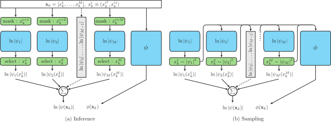
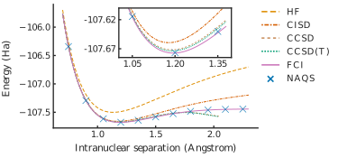

# naqs-for-quantum-chemistry
[](https://arxiv.org/abs/2109.12606)
[](./LICENSE)

---

This repository contains the codebase developed for the paper [Autoregressive neural-network wavefunctions for *ab initio* quantum chemistry](https://arxiv.org/abs/2109.12606).

---

|  |  |
|:---:|:---:|
| (a) Architecture of a neural autoregressive quantum state (NAQS) | (b) Energy surface of N<sub>2</sub> |

#### TL;DR

If you don't care for now, and you just want to see it running, here are two links to notebooks that will set-up and run on Colab.  Just note that Colab will not have enough memory to run experiments on the largest molecules we considered.

- [run_naqs.ipynb](notebooks/run_naqs.ipynb) [](https://colab.research.google.com/github/tomdbar/naqs-for-quantum-chemistry/blob/main/notebooks/run_naqs.ipynb): Run individual experiments or batches of experiments, including those to recreate published results.

- [generate_molecular_data_and_baselines.ipynb](notebooks/generate_molecular_data_and_baselines.ipynb) [](https://colab.research.google.com/github/tomdbar/naqs-for-quantum-chemistry/blob/main/notebooks/generate_molecular_data_and_baselines.ipynb):
    1. Create the ``[molecule].hdf5`` and ``[molecule]_qubit_hamiltonian.pkl`` files required (these are provided for molecules used in the paper in the [molecules](molecules) directory.)
    2. Solve these molecules using various canconical QC methods using Psi4.

## Overview

#### Quantum chemistry with neural networks

A grand challenge of *ab-inito* quantum chemistry (QC) is to solve the many-body Schrodinger equation describing interaction of heavy nuclei and orbiting electrons.  Unfortunatley, this is an extremely (read, NP) hard problem, and so a significant amout of research effort has, and continues, to be directed towards numerical methods in QC.  Typically, these methods work by optimising the wavefunction in a basis set of "Slater determinants".  (In practice these are anti-symetterised tensor products of single-electron orbitals, but for our purposes let's not worry about the details.)  Typically, the number of Slater determinants - and so the complexity of optimisation - grows exponentially with the system size, but recently machine learning (ML) has emerged as a possible tool with which to tackle this seemingly intractable scaling issue.

*Translation/disclaimer: we can use ML and it has displayed some promising properties, but right now the SOTA results still belong to the established numerical methods (e.g. coupled-cluster) in practical settings.*

#### Project summary

We follow the approach proposed by [Choo *et al.*](https://www.nature.com/articles/s41467-020-15724-9?platform=oscar&draft=collection) to map the exponentially complex system of interacting fermions to an equivilent (and still exponentially large) system of interacting qubits (see their or [our paper](https://arxiv.org/abs/XXXX.XXXX) for details).  The advantage being that we can then apply neural network quantum states (NNQS) originally developed for condensed matter physics (CMP) (with distinguishable interacting particles) to the electron structure calculations (with indistinguishable electrons and fermionic anti-symettries).

This project proposes that simply applying techniques from CMP to QC will inevitably fail to take advantage of our significant *a priori* knowledge of molecular systems.  Moreover, the stochastic optimisation of NNQS relies on repeatedly sampling the wavefunction, which can be prohibitively expensive.  This project is a sandbox for trialling different NNQS, in particular an ansatz based on autoregressive neural networks that we present in the paper.  The major benefits of our approach are that it:
   
1. allows for highly efficient sampling, especially of the highly asymmetric wavefunction typical found in QC,
2. allows for physical priors - such as conservation of electron number, overall spin and possible symettries - to be embedded into the network without sacrificing expressibility.

## Getting started

#### In this repo

##### [notebooks](notebooks)

- [run_naqs.ipynb](notebooks/run_naqs.ipynb) [](https://colab.research.google.com/github/tomdbar/naqs/blob/naqs-for-quantum-chemistry/notebooks/run_naqs.ipynb): Run individual experiments or batches of experiments, including those to recreate published results.

- [generate_molecular_data_and_baselines.ipynb](notebooks/generate_molecular_data_and_baselines.ipynb) [](https://colab.research.google.com/github/tomdbar/naqs/blob/naqs-for-quantum-chemistry/notebooks/generate_molecular_data_and_baselines.ipynb):
    1. Create the ``[molecule].hdf5`` and ``[molecule]_qubit_hamiltonian.pkl`` files required (these are provided for molecules used in the paper in the [molecules](molecules) directory.)
    2. Solve these molecules using various canconical QC methods using Psi4.

##### [experiments](experiments)

Experimental scripts, including those to reproduced published results, for NAQS and Psi4.

##### [molecules](molecules)

The molecular data required to reproduce published results.

##### [src](src) / [src_cpp](src_cpp)

Python and cython source code for the main codebase and fast calculations, respectively.

#### Running experiments

Further details are provided in the [run_naqs.ipynb](notebooks/run_naqs.ipynb) notebook, however the published experiments can be run using the provided batch scripts.

```
>>> experiments/bash/naqs/batch_train.sh 0 LiH
```

Here, 0 is the GPU number to use (if one is available, otherwise the CPU will be used by default) and ``LiH`` can be replaced by any folder in the [molecules](molecules) directory.  Similarly, the experimental ablations can be run using the corresponding bash scripts.

```
>>> experiments/bash/naqs/batch_train_no_amp_sym.sh 0 LiH
>>> experiments/bash/naqs/batch_train_no_mask.sh 0 LiH
>>> experiments/bash/naqs/batch_train_full_mask.sh 0 LiH
```

#### Requirements

The underlying neural networks require [PyTorch](https://pytorch.org/).  The molecular systems are typically handled by [OpenFermion](https://github.com/quantumlib/OpenFermion) with the backend calculations and baselines requiring and [Psi4](http://psicode.org/).  **Note that this code expects OpenFermion 0.11.0 and will need refactoring to work with newer versions.**  Otherwise, all other required packages - numpy, matplotlib, seaborn if you want pretty plots etc - are standard.  However, to be concrete, the linked Colab notebooks will provide an environment in which the code can be run.

## Reference

If you find this project or the associated paper useful, it can be cited as below.

    @article{barrett2021autoregressive,
      title={Autoregressive neural-network wavefunctions for ab initio quantum chemistry},
      author={Barrett, Thomas D and Malyshev, Aleksei and Lvovsky, AI},
      journal={arXiv preprint arXiv:2109.12606},
      year={2021}
    }
